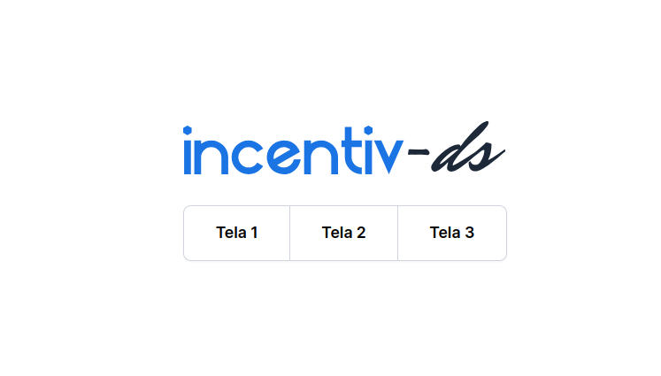

<h1 align="center"> Incentiv-ds </h1>

<p align="center">
Um code test para vaga de desenvolvedor Front-End na Incentiv.
</p>

<p align="center">
  <a href="#-the-challenge">O Desafio</a>&nbsp;&nbsp;&nbsp;|&nbsp;&nbsp;&nbsp;
  <a href="#-learning-goals">Funcionalidades</a>&nbsp;&nbsp;&nbsp;|&nbsp;&nbsp;&nbsp;
  <a href="#-technologies">Tecnologias</a>&nbsp;&nbsp;&nbsp;|&nbsp;&nbsp;&nbsp;
  <a href="#-deploy">Deploy</a>&nbsp;&nbsp;&nbsp;|&nbsp;&nbsp;&nbsp;
  <a href="#-project">Projeto</a>
</p>

<p align="center">

</p>

<p align="center">
  
</p>

<br>

<p align="center">
  
</p>

<br>

## 🏆 The challenge

The challenge was to build a React application that fetch products data from an API and show a products galery on main page, a contact page and a product details page.

Users should be able to:

- Navigate between pages visualizing info and images from an external API.
- See product detail after clicking a product card on main page
- View the optimal layout depending on their device's screen size
- See hover and focus states for all interactive elements on the page

<br>

## 🎯 Learning goals

Put my recent knowledge through its paces using most of the React tools I'm studying in the last couple of months such as Components, Hooks, CSS-in-JS and React Router.

<br>

## 🚀 Technologies

This project was built using following libraries/frameworks:

- React
- Next
- Tailwind

<br>

## 🌎 Deploy

Live Site URL: [ranek-challenge](https://ranek-challenge-4mokm4i5j-tascintra.vercel.app/)

<br>

## 💻 Project


---

#### :memo: License

This project is under a MIT license.


This is a [Next.js](https://nextjs.org/) project bootstrapped with [`create-next-app`](https://github.com/vercel/next.js/tree/canary/packages/create-next-app).

## Getting Started

First, run the development server:

```bash
npm run dev
# or
yarn dev
# or
pnpm dev
```

Open [http://localhost:3000](http://localhost:3000) with your browser to see the result.

You can start editing the page by modifying `app/page.tsx`. The page auto-updates as you edit the file.

This project uses [`next/font`](https://nextjs.org/docs/basic-features/font-optimization) to automatically optimize and load Inter, a custom Google Font.

## Learn More

To learn more about Next.js, take a look at the following resources:

- [Next.js Documentation](https://nextjs.org/docs) - learn about Next.js features and API.
- [Learn Next.js](https://nextjs.org/learn) - an interactive Next.js tutorial.

You can check out [the Next.js GitHub repository](https://github.com/vercel/next.js/) - your feedback and contributions are welcome!

## Deploy on Vercel

The easiest way to deploy your Next.js app is to use the [Vercel Platform](https://vercel.com/new?utm_medium=default-template&filter=next.js&utm_source=create-next-app&utm_campaign=create-next-app-readme) from the creators of Next.js.

Check out our [Next.js deployment documentation](https://nextjs.org/docs/deployment) for more details.
